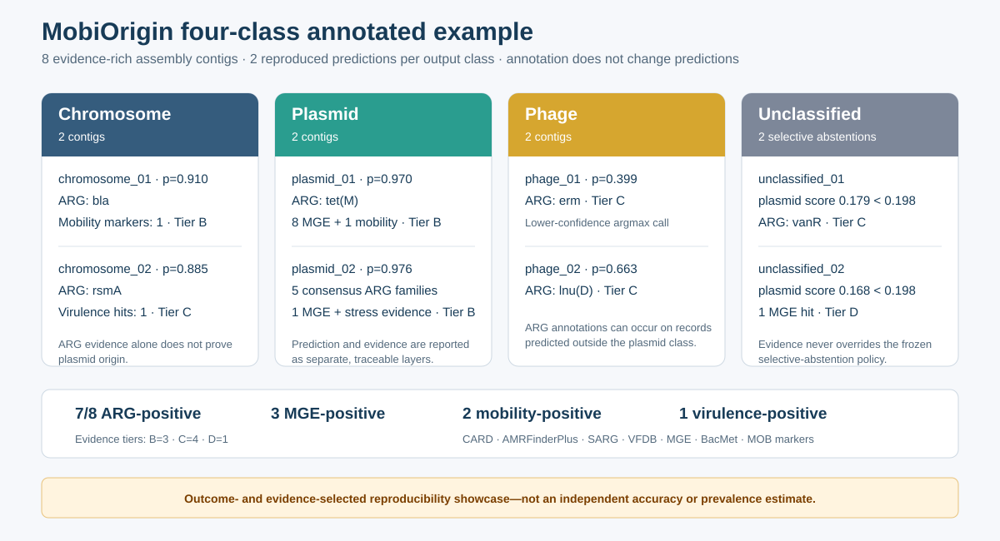

# MobiOrigin

[](https://www.python.org/)
[](https://pypi.org/project/mobiorigin/)
[](https://www.gnu.org/licenses/gpl-3.0)

MobiOrigin is a CPU-oriented sequence-and-marker classifier for assigning bacterial DNA fragments to chromosome, plasmid, phage, or an explicit unclassified state. The frozen dev1 candidate combines 9,557 sequence features with 17 MOB-suite-derived protein-marker features and an equal-weight ensemble of three independently trained neural networks.

## Status

- Package version: `0.1.4` (release candidate with verified external model transport).
- Supported input length: 1,000–500,000 bp. Records outside this range remain explicitly unclassified.
- Runtime: deterministic CPU inference; 1–128 requested external-search threads.
- Network access during prediction: none.
- Models: three unchanged frozen checkpoints retrieved once during setup from a versioned GitHub release asset. The archive and every extracted artifact are SHA-256 verified before atomic installation.
- Marker databases: prepared automatically from the official MOB-suite database
  in an isolated helper environment, then identity verified before use. They are
  not redistributed inside the Python package. See
  [`docs/MOBIORIGIN_DATABASE_SETUP.md`](docs/MOBIORIGIN_DATABASE_SETUP.md).

## Quick start: install, verify, and see an example

The guided Conda or Mamba route is recommended for a new installation. It
installs the Python package, DIAMOND, AMRFinderPlus, models, marker databases,
annotation databases, and a complete verification example:

```bash
git clone --filter=blob:none --single-branch https://github.com/Raza-pl/MobiOrigin.git
cd MobiOrigin
bash install.sh
conda activate mobiorigin
```

MobiOrigin uses one visible Conda/Mamba environment. The guided installer adds
MobiOrigin, CPU-only PyTorch, NumPy, Pyrodigal, DIAMOND, and official
AMRFinderPlus; prepares the identity-verified marker databases in an isolated
helper environment; retrieves the exact frozen model bundle; checks the
installation; and runs a bundled eight-contig comprehensive verification.

The installer uses Mamba when available and otherwise Conda. It never enables
shell `errexit`, never deletes an existing database or result directory, and
prints a resume command if a stage fails. Windows users should run it inside
Ubuntu on WSL2. The runtime is CPU-only and does not install CUDA.

On Apple Silicon, prediction and annotation run in the native arm64
`mobiorigin` environment. Only the temporary MOB-suite database helpers use
`osx-64` packages under Rosetta because MOB-suite 3.1.8 requires historical
dependencies that are unavailable as native arm64 packages.

When installation succeeds, the final check creates:

```text
~/mobiorigin_demo/
├── README_RESULTS.txt
├── annotation/
│   ├── annotation_warnings.tsv
│   ├── biological_evidence.tsv
│   ├── mobiorigin_annotated_results.tsv
│   └── mobiorigin_report.html
├── predictions/
│   ├── predictions.tsv
│   ├── provenance.json
│   └── SHA256SUMS.txt
└── visualization/
    ├── mobiorigin_dashboard.html
    ├── mobiorigin_summary.svg
    ├── prediction_summary.tsv
    ├── prediction_by_length_bin.tsv
    ├── visualization_summary.json
    └── SHA256SUMS.txt
```

Open `~/mobiorigin_demo/visualization/mobiorigin_dashboard.html` to see the same
kind of report produced for a real assembly. The bundled FASTA contains two
software-demonstration records for each output class. The comprehensive check
exercises the installed models, marker databases, CARD, SARG, AMRFinderPlus,
VFDB, mobileOG-db, BacMet, prediction, annotation, tables, SVG, and HTML. It is
an installation test, not an accuracy or prevalence study. Check the
installation again at any time with:

```bash
mobiorigin doctor
```

The comprehensive annotation report uses consistent columns for gene symbol,
gene name, gene family, functional class, functional subclass, and mechanism.
Database-specific terminology and accessions remain available in the detailed
evidence table, and no annotation changes an origin prediction.

Normal setup and doctor outputs are concise. Add `--verbose` to either
`bash install.sh`, `mobiorigin setup-databases`, or `mobiorigin doctor` when the
complete per-file checksum inventory is required for an audit.

Use `bash install.sh --software-only` to defer database preparation. The
complete [installation and analysis tutorial](docs/INSTALLATION_AND_TUTORIAL.md)
covers manual installation, Apple Silicon, Linux, WSL2, diagnostics, and
database licensing boundaries.

### PyPI route for managed environments

If DIAMOND, AMRFinderPlus, and the required databases are already managed
locally, install the Python package from PyPI and retrieve the frozen models:

```bash
python -m pip install mobiorigin==0.1.4
mobiorigin setup-databases --component models
```

The PyPI wheel does not redistribute third-party MOB-suite database records or
replace the external DIAMOND and AMRFinderPlus executables. Use the guided route
above for a new complete installation.

The installer includes the official AMRFinderPlus software and its BLAST/HMMER
runtime dependencies. `mobiorigin setup-databases --component annotation`
downloads permitted resources from their official sources, builds the DIAMOND
indexes locally, and verifies the complete CARD/SARG/AMRFinderPlus/VFDB/
mobileOG-db/BacMet/MOB resource set in one atomic operation. ISfinder is not
required or downloaded; authorized users can add it as an optional legacy
evidence layer. Every installed file is hashed and recorded in a manifest.

MobiOrigin is published on [PyPI](https://pypi.org/project/mobiorigin/) through
token-free Trusted Publishing. The Bioconda recipe is being updated for 0.1.4.

## Prepare models and marker databases

The PyPI-ready package does not duplicate the 121 MB model payload inside every
wheel and source archive. The guided installer retrieves the exact versioned
model bundle and then prepares the third-party marker databases automatically.
To run or resume both stages:

```bash
bash scripts/setup_mobiorigin_databases.sh \
  "${XDG_DATA_HOME:-$HOME/.local/share}/mobiorigin/marker_databases"
```

The helper first installs the model bundle under
`${XDG_DATA_HOME:-$HOME/.local/share}/mobiorigin/models/dev1`. It verifies the
archive SHA-256 and all five artifact identities before publishing the directory.
It then prepares the marker databases. It never installs MOB-suite into the
`mobiorigin` runtime environment and never overwrites an existing output
directory. Complete manual and offline steps are documented in
[`docs/MOBIORIGIN_DATABASE_SETUP.md`](docs/MOBIORIGIN_DATABASE_SETUP.md).
Prediction fails closed if any model or database identity differs.

## Prepare annotation databases

After the marker-database step above has passed, install the complete annotation
set with one command:

```bash
mobiorigin setup-databases \
  --component annotation \
  --profile comprehensive \
  --accept-third-party-terms
```

The default destination is
`${XDG_DATA_HOME:-$HOME/.local/share}/mobiorigin/annotation_databases`.
This retrieves CARD, SARG, AMRFinderPlus, VFDB core, mobileOG-db, and BacMet
from pinned or official endpoints, builds local DIAMOND indexes, reuses the
verified MOB marker databases, and retains resumable downloads in the user
cache. Comprehensive setup downloads the approximately 2.1 GB mobileOG-db
protein release and therefore needs several gigabytes of temporary/free space.
It does not publish a partial destination after failure. Recheck it at any time:

```bash
mobiorigin setup-databases \
  --component annotation \
  --profile comprehensive \
  --check
```

`MOBIORIGIN_ANNOTATION_DATABASE_DIR` changes the default location. Details and
the upstream terms links are in
[`docs/MOBIORIGIN_ANNOTATION.md`](docs/MOBIORIGIN_ANNOTATION.md).

New database installations also audit every mobileOG FASTA header and bind the
audit to the database manifest. During annotation, an unusual mobileOG result
that cannot be resolved is excluded from evidence and written to
`annotation/annotation_warnings.tsv`. MobiOrigin never guesses its identity.

## Run

The simplest command performs prediction, comprehensive biological annotation,
and integrated visualization in one atomic result directory:

```bash
mobiorigin run \
  --input-fasta assembly.fasta \
  --output-dir mobiorigin_results \
  --threads 8
```

MobiOrigin uses the documented user-data location by default. Advanced users
can override the marker database with `--database-dir` and the annotation
database with `--annotation-database-dir`. The corresponding environment
variables are `MOBIORIGIN_MODEL_DIR`, `MOBIORIGIN_DATABASE_DIR`, and
`MOBIORIGIN_ANNOTATION_DATABASE_DIR`.

For a quick prediction and visualization without biological annotation:

```bash
mobiorigin run \
  --input-fasta assembly.fasta \
  --output-dir mobiorigin_results \
  --skip-annotation \
  --threads 8
```

For prediction files without visualization:

```bash
mobiorigin predict \
  --input-fasta assembly.fasta \
  --output-dir mobiorigin_predictions \
  --threads 8
```

The output directory must not already exist. Input FASTA identifiers must be unique first-token identifiers, and sequences may contain standard IUPAC DNA symbols. If prediction finishes but a later annotation stage fails, the incomplete workspace is retained as `<output-dir>.failed` with `ANALYSIS_FAILED.json`; it is not presented as a completed result.

`--threads` accepts values from 1 to 128 and controls DIAMOND and other
external-search workers. Choose a value no larger than the CPUs allocated to
the process. Neural-network inference remains single-threaded for deterministic
output, so values above the available CPUs may be slower rather than faster.

## Outputs

The `run` output directory contains `README_RESULTS.txt` and three principal
directories:

- `predictions/`: ordered labels, probabilities, abstentions, and provenance.
- `annotation/`: ARG, virulence, MGE, stress, and mobility evidence plus a
  standalone biological-evidence report.
- `visualization/`: the integrated HTML dashboard, editable SVG figure, and
  summary tables. When annotation is enabled, the dashboard includes A to E
  evidence-tier counts.

The prediction directory contains:

- `predictions.tsv`: ordered per-record labels, probabilities, plasmid margin, and abstention reason.
- `provenance.json`: package version, input identity, model/database identities, threshold, and prediction identity.
- `SHA256SUMS.txt`: output checksums.

See [`docs/MOBIORIGIN_OUTPUT_SCHEMA.md`](docs/MOBIORIGIN_OUTPUT_SCHEMA.md) for the exact schema and interpretation.

## Visualize predictions

Create summary tables, an editable SVG figure, and a browser-ready HTML dashboard without adding plotting dependencies:

```bash
mobiorigin visualize \
  --predictions-tsv mobiorigin_results/predictions.tsv \
  --output-dir mobiorigin_visualization
```

Open `mobiorigin_visualization/mobiorigin_dashboard.html`. The dashboard reports contig- and base-pair-weighted prediction proportions and length-stratified plasmid calls. It is descriptive and does not calculate accuracy.

## Independent biological annotation

`mobiorigin annotate` adds protein-level biological evidence after
classification. It never changes MobiOrigin labels, probabilities, or the
selective threshold. This command is useful when prediction already exists or
annotation must be repeated separately. The default `mobiorigin run` command
already performs the comprehensive annotation described here. The ARG profile
retains independent CARD, SARG, and
official AMRFinderPlus evidence. The comprehensive profile additionally reports
AMRFinderPlus virulence/stress calls, VFDB core homologs, mobileOG-db MGE evidence,
BacMet2 biocide/metal-resistance homologs, and MOB-suite replication, relaxase,
and mating-pair-formation markers.

```bash
mobiorigin annotate \
  --input-fasta assembly.fasta \
  --output-dir mobiorigin_annotations \
  --profile comprehensive \
  --predictions-tsv mobiorigin_predictions/predictions.tsv \
  --amrfinder-mode official \
  --threads 8
```

The command uses the standard annotation-database directory prepared above;
`--database-dir` remains available as an override. The integrated table,
machine-readable summary, self-contained HTML report,
raw evidence, and every consumed database identity are published atomically.
The A–E evidence-priority tier is a transparent review queue based on ARG and
mobility context; it is not a clinical risk score. Database layout, thresholds,
provenance, licensing boundaries, and output schemas are documented in
[`docs/MOBIORIGIN_ANNOTATION.md`](docs/MOBIORIGIN_ANNOTATION.md).

To add evidence-tier summaries to the visualization:

```bash
mobiorigin visualize \
  --predictions-tsv mobiorigin_results/predictions.tsv \
  --annotated-results-tsv mobiorigin_annotations/mobiorigin_annotated_results.tsv \
  --output-dir mobiorigin_annotated_visualization
```

## Four-class annotated example

The repository includes an eight-record assembly example at
[`src/mobiorigin/data/examples/annotated_assembly_example.fasta`](src/mobiorigin/data/examples/annotated_assembly_example.fasta).
It contains two supported-length records that reproducibly produce each
MobiOrigin output class. Run the prediction and visualization test with:

```bash
conda activate mobiorigin
bash scripts/run_mobiorigin_assembly_example.sh
```

The script writes a fresh timestamped output directory, verifies the expected
2/2/2/2 class accounting, and reports the prediction table and HTML dashboard.
To run comprehensive annotation on the same records, supply the prepared
annotation-database directory described above:

```bash
ANNOTATION_DATABASE=/path/to/annotation_databases \
  bash scripts/run_mobiorigin_assembly_example.sh
```

Comprehensive annotation runs independently after prediction and does not alter
any label, probability, or abstention decision.



| Example | MobiOrigin output | Prediction detail | Selected annotation evidence | Tier |
|---|---|---|---|---:|
| `assembly_example_chromosome_01` | Chromosome | chromosome probability 0.910 | `bla`; one mobility marker | B |
| `assembly_example_chromosome_02` | Chromosome | chromosome probability 0.885 | `rsmA`; one virulence hit | C |
| `assembly_example_plasmid_01` | Plasmid | plasmid probability 0.970 | `tet(M)`; eight MGE hits; one mobility marker | B |
| `assembly_example_plasmid_02` | Plasmid | plasmid probability 0.976 | `EreA`, `aadA`, `linG`, `qacEdelta1`, `sul1`; one MGE hit | B |
| `assembly_example_phage_01` | Phage | phage probability 0.399 | `erm` | C |
| `assembly_example_phage_02` | Phage | phage probability 0.663 | `lnu(D)` | C |
| `assembly_example_unclassified_01` | Unclassified | plasmid score 0.179, below 0.198 threshold | `vanR` | C |
| `assembly_example_unclassified_02` | Unclassified | plasmid score 0.168, below 0.198 threshold | one MGE hit | D |

This deliberately evidence-rich set demonstrates the output schema, all four
labels, selective abstention, and biological-evidence reporting. Because the
records were selected using earlier MobiOrigin outputs and annotations, the
observed 7/8 ARG-positive fraction is **not** an accuracy, prevalence, or
independent-validation estimate. It also illustrates why annotation remains a
separate layer: ARG or mobility evidence can occur on chromosome, phage, and
unclassified records and therefore does not by itself prove plasmid origin.

The bundled example runner
[`scripts/run_mobiorigin_assembly_example.sh`](scripts/run_mobiorigin_assembly_example.sh)
uses Bash and works on macOS, Linux, and WSL2. Third-party annotation databases
are not redistributed; without `ANNOTATION_DATABASE`, the script performs the
four-class prediction and visualization test and skips annotation explicitly.

## Prospective external validation

The frozen prospective external cohort contained 3,000 fragments from 3,000 distinct versioned source accessions. MobiOrigin and geNomad 1.12.0/database 1.9 received identical class-hidden FASTA bytes, and both prediction sets were frozen before label release.

| Metric | MobiOrigin | geNomad | Difference |
|---|---:|---:|---:|
| Three-class macro-F1¹ | 0.7889 | 0.7574 | +0.0315 |
| Plasmid binary F1¹ | 0.7453 | 0.6876 | +0.0578 |
| Plasmid precision² | 0.7518 | 0.8930 | −0.1412 |
| Plasmid sensitivity² | 0.7390 | 0.5590 | +0.1800 |
| Prediction coverage² | 0.9737 | 0.9993 | −0.0257 |

¹ Preregistered co-primary endpoints. Both MobiOrigin advantages had positive paired source-bootstrap 95% intervals and remained significant after Holm correction across the two endpoints.
² Descriptive metrics, not preregistered superiority endpoints.

The result supports higher macro-F1 and plasmid binary F1 on this frozen cohort. It does **not** support higher plasmid precision, higher coverage, or universal superiority. MobiOrigin traded lower precision and modestly lower coverage for substantially higher plasmid sensitivity. The external cohort is closed to retrospective tuning and record-level error mining.

Aggregate validation tables, methods, figure data, and frozen claim boundaries are in [`docs/validation/external_validation`](docs/validation/external_validation/README.md).

### Additional exploratory comparator analysis

The prospective MobiOrigin evaluation used geNomad as the preregistered comparator. After that analysis was complete, predictions from PlasClass, PlasFlow v1, PLASMe, and Platon were frozen on the same 3,000-record external cohort and evaluated under a separate post-hoc exploratory contract.

| Tool | Plasmid F1 | Balanced accuracy | Precision | Sensitivity | Coverage |
|---|---:|---:|---:|---:|---:|
| MobiOrigin | 0.7453 | 0.8085 | 0.7518 | 0.7390 | 0.9737 |
| PlasClass | 0.6070 | 0.6943 | 0.5070 | 0.7560 | 1.0000 |
| PlasFlow v1 | 0.5788 | 0.6835 | 0.5737 | 0.5840 | 0.6987 |
| PLASMe | 0.3635 | 0.6093 | 0.9454 | 0.2250 | 1.0000 |
| Platon | 0.5774 | 0.7023 | 0.9649 | 0.4120 | 1.0000 |

MobiOrigin had the highest F1 and balanced accuracy in this secondary comparison, and all eight paired MobiOrigin-minus-comparator tests were positive after Holm adjustment. These findings are exploratory, not additional preregistered co-primary evidence. PlasClass had slightly higher sensitivity, while PLASMe and Platon had higher precision but substantially lower sensitivity. Full methods, paired intervals, and mandatory claim limitations are included in the validation-evidence directory linked above.

<!-- BEGIN REAL-ASSEMBLY OPERATIONAL VALIDATION -->
## Real-assembly operational validation

MobiOrigin and five comparators were run on two deterministic real-assembly subsets containing 2,488 and 2,445 records (approximately 15.5 Mb each). All 12 dataset–tool routes completed. The publication bundle reports end-to-end runtime, call fraction, coverage, label-free agreement, and biological evidence-priority tiers. These assemblies do not have frozen record-level ground truth, so this analysis does **not** support accuracy or superiority claims. Evidence tiers A–E prioritize follow-up and are not clinical risk scores.

Tables, an editable SVG figure, methods, and mandatory claim boundaries are available in [`docs/validation/operational_validation`](docs/validation/operational_validation).
<!-- END REAL-ASSEMBLY OPERATIONAL VALIDATION -->

## Reproducibility and scope

- External evaluation: 10,000 paired bootstrap replicates over `source_accession`, seed `20260818`.
- Multiplicity: Holm correction across three-class macro-F1 and plasmid binary F1.
- Candidate: `mobiorigin-dev1-mob-selective-v1` with frozen selective threshold `0.19835489988327026`.
- geNomad output is not used as a MobiOrigin feature or teacher.
- Hard biological overrides and post-hoc probability transfer are not used.
- The frozen external cohort cannot be used for further model or threshold tuning.

## Licensing and citation

MobiOrigin source code is distributed under GPL-3.0. Third-party MOB-suite-derived database records are not bundled and retain their own provenance and licensing conditions. The official MOB-suite repository is Apache-2.0 licensed, but this project does not assume that license establishes redistribution rights for every record in its separately hosted database archive.

Use the versioned metadata in [`CITATION.cff`](CITATION.cff) when citing the software. An archival DOI can be added after the tagged release is deposited; until then, include the repository URL, version, and commit used for analysis. Release changes are recorded in [`CHANGELOG.md`](CHANGELOG.md).
